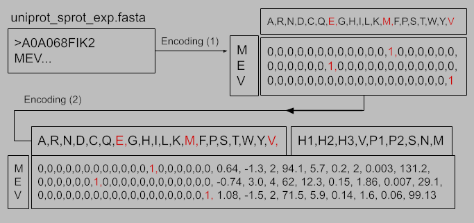
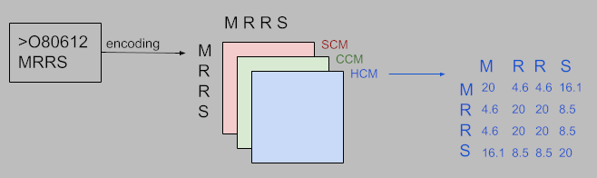

# protEncoder

## description

protEncoder is a python package that encodes protein fasta files using different methods into smaller batches. In addition, it encodes Gene Ontology Annotation (GOA) using One-Hot encoding. Finally, it decodes predictions made by [GOlite](https://github.com/anazhmetdin/GOlite).

## Available methods

### 1. One-Hot

Each amino acid is represented by 20 digits corresponding to the 20 amino acids; only one digit is marked as '1' corresponding to the single amino acid while the other 19 digits are zeros.
The second step is adding additional nine digits
representing nine physicochemical properties [[1]](10.1371/journal.pone.0147467):

-   hydrophobicity
-   hydrophilicity
-   hydrogen bond
-   volumes of
    side chains
-   polarity
-   polarizability
-   solvent-accessible surface area
-   net charge index of side
    chains
-   average mass of amino acid

There are four amino acid codes used in sequencing
to denote the interchangeability between some amino acids or an ambiguity in the protein.
These codes are:

-   Asx (B) which means Aspartic acid or Asparagine
-   Glx (Z) which means Glutamic acid or Glutamine
-   Xaa (X) which means any amino acid
-   Xle (J) which means Leucine or Isoleucine.

In order to encode these codes adding '0.5' instead of '1' in the place of any possible amino acid indicated by these codes, and averaging the physicochemical properties of the corresponding amino acids. In addition, there are two synthetic amino acids:

-   Pyrrolidine (O) which is treated as Lysine
-   Selenocysteine (C) which is treated as Cysteine.

Proteins are either cropped or padded to a fixed size determined by the `maxLen` parameter

#### GOA

Annotation should be in a text file where each line represents one annotation term following this pattern:

\<accession number> \<go term> \<namespace>

\<namespace> indicates one of the three GO ontologies:

-   F: molecular function
-   P: biological process
-   C: cellular component

### 2. Kmers Frequency (KmerHz)

Proteins are encoded by counting each possible kmer in the protein and storing them in a constant order across all proteins. The size of the kmers is dynamically assigned by the `kmerLength` parameter

Ambigous amino acids are randomly assigned to one of their corresponding essential amino acids.

### 3. ProtVec

ProtVec [[2]](https://github.com/kyu999/biovec) which is based on word2vec, one of the most reliable tools in NLP usually used in classifying passages based on the context. ProtVect uses 3-grams method to encode each protein in a 3x100 vector. Where similar proteins will have closer vectors in this space.

Ambigous amino acids are randomly assigned to one of their corresponding essential amino acids.

### 4. Compatibility Matrices (CoMatrices)

This is our suggested method based on different fields of research. The objective of this approach is to find a compatible method of protein encoding with the more advanced NN DenseNet, which requires input of specific dimension (224, 224, 3) in case the number of labels needs to be other than 1000.

Ambigous amino acids are randomly assigned to one of their corresponding essential amino acids.

## Input and Output

### Input

#### Decoding

-   ##### predictionFile `-P`
    File path pattern of the predictions to be decoded (Regex)
-   ##### GOfilter `-F`
    file path of the GO labels in order

#### Encoding

-   ##### seqPath `-d`
    File path of the fasta file having the proteins sequence
-   ##### -GOfile `-g`
-   ##### method `-M`
    Protein encoding method;
    -   c: compatibility matrices,
    -   k: kmers frequency,
    -   o: (default) one-hot,
    -   p: ProtVec
-   ##### collection `-c`
    File path of proteins annotation
-   ##### -maxLen `-m`
    maximum length of proteins in one-hot and compatibility matrices methods only;
    -   -1: max protein length
    -   2000: (default)
-   ##### chopSize `-s`
    Number of sequences to be encoded in each file

for more input options see the package documentation:

> protencoder --help

### Output:

#### Decoding

-   One text file following the CAFA guidelines
    

#### Encoding

-   One text file containing the most frequent GO terms in each
    ontology.
    -   File name: outPrefix_filter_numFreqGO.txt
    -   Lines: <GO_term GO_ontology>
-   Fasta file for each batch
    -   File name pattern: outPrefix_partx.fasta (x = part number)
-   npy file for each batch containing the encoded proteins.
    -   File name pattern: outPrefix_partx_method.npy
-   Text file for each batch containing the encoded proteins keys.
    -   File name pattern: outPrefix_partx_key

## Getting started

### Installing the package

-   Download the latest release: [releases](https://github.com/anazhmetdin/protEncoder/releases)

-   In your command line environment:

> pip install path/to/protencoder-x.x.x-py2.py3-none-any.whl

### Run an example

-   In your Command Line environment:

> protencoder -d uniprot_sprot_exp.fasta -M o -m 1000 -s 50 -c uniprot_sprot_exp.txt -n 1000 -o m1000_s50_n1000

-   you can try with files in [protencoder/data](https://github.com/anazhmetdin/protEncoder/tree/main/protencoder/data)
